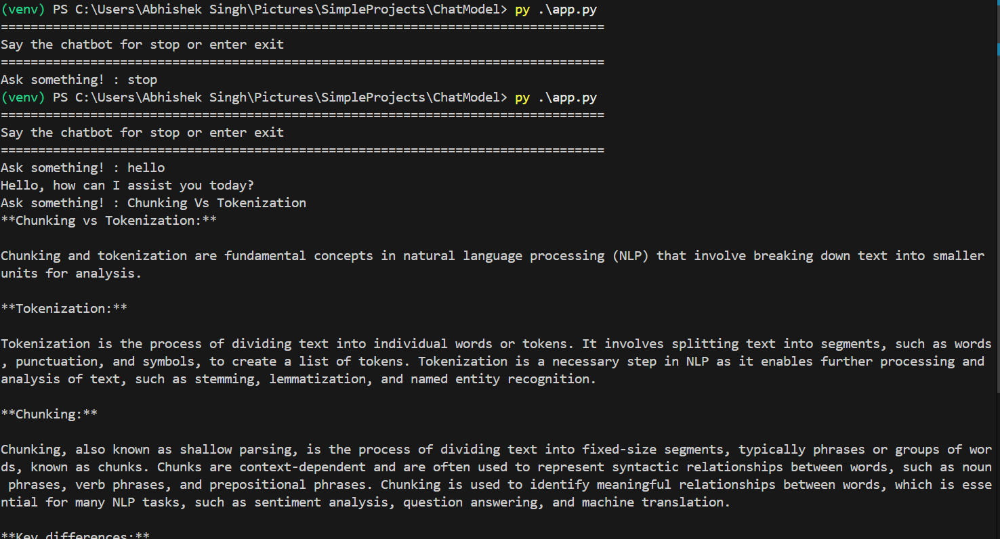
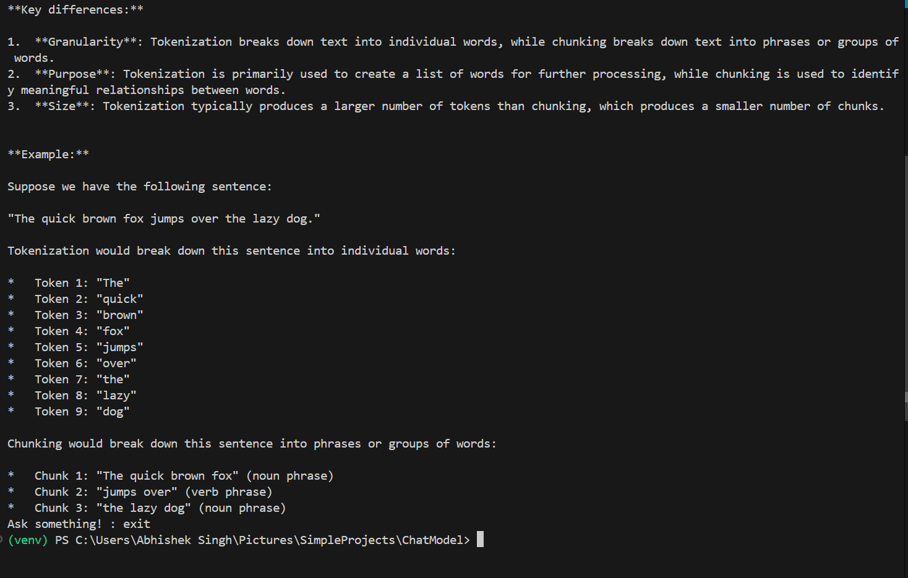

# ChatModel — Simple Groq Chat Demo

This small project demonstrates a minimal chat client that uses the Groq Python SDK to create chat completions. The README includes the sample output images found in `output folder` and short setup/run instructions.

## Screenshots





## Quick links / References

- Groq quickstart: https://console.groq.com/docs/quickstart
- Groq text chat docs: https://console.groq.com/docs/text-chat

## Requirements

- Python 3.8 or newer
- The dependencies are listed in `requirements.txt` (uses `groq` and `python-dotenv`).

## Setup (PowerShell)

1. Create and activate a virtual environment:

```powershell
python -m venv .venv
.\.venv\Scripts\activate
```

2. Install dependencies:

```powershell
pip install -r requirements.txt
```

3. Create a `.env` file and set the `GROQ_API_KEY` environment variable. The `.env` file should contain:

```env
GROQ_API_KEY=your_groq_api_key_here
```

## Run the chat app

Run the small interactive script:

```powershell
python app.py
```

Type queries when prompted. To stop, type `exit` `stop`(the app listens for the `exit` response and quits).

## Files of interest

- `app.py` — Simple interactive loop that calls `chatModel.ask()`.
- `chatModel.py` — Wraps the Groq client and exposes `ask(query, model, temperature)`.
- `requirements.txt` — Project dependencies.
- `.env` — Environment file (store your API key here).

## Troubleshooting

- If you get import errors, ensure you're in the virtual environment and that `pip install -r requirements.txt` completed successfully.
- If you see authentication errors, confirm that `GROQ_API_KEY` is set correctly in the `.env` file or environment.
